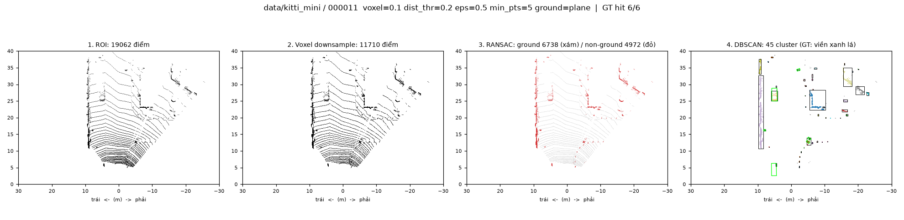
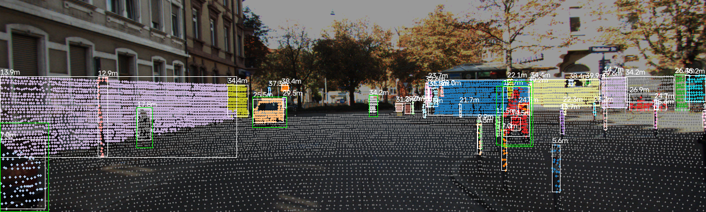
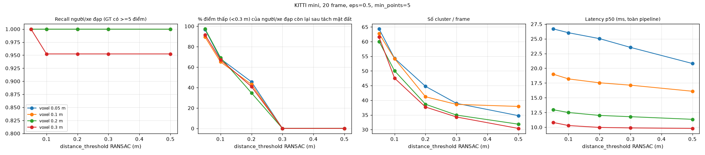
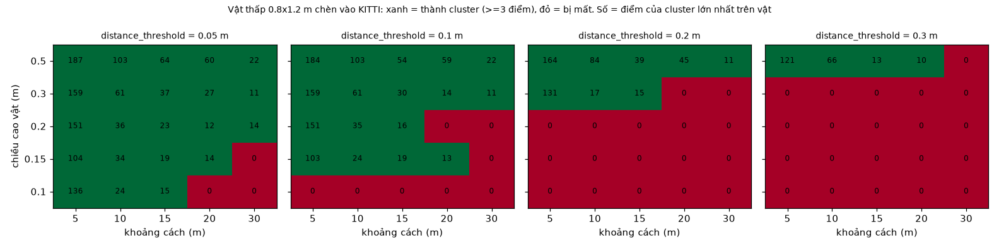
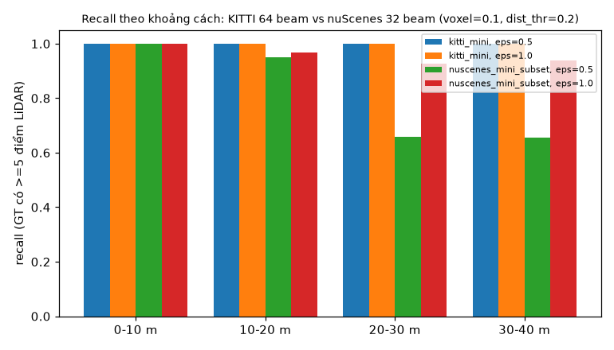
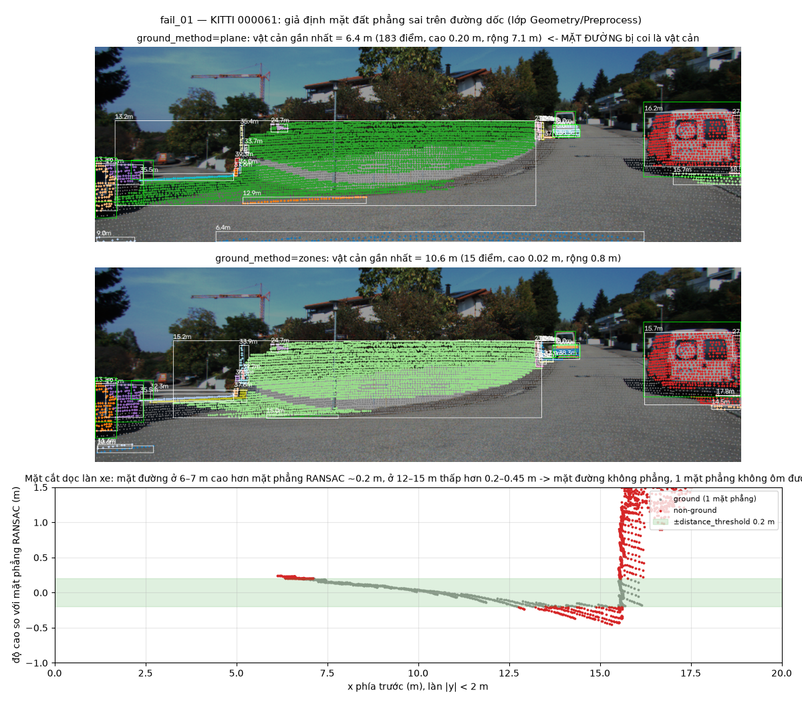

# Báo cáo Day 6: Phát hiện vật cản từ LiDAR không dùng deep learning — vật thấp sát đất bị mất ở đâu?

- **Họ tên:** Dinh Lenh Tien Anh
- **MSSV:** 2A202602928 (phải trùng với MSSV trong tên repo `<HoVaTen>-<MSSV>-Track4-Day21`)
- **Lớp:** K4-Track4-H209
- **Link repo:** https://github.com/AIVIETNAM-AIO-AnhDinh/DinhLenhTienAnh-2A202602928-Track4-Day21
- **Topic:** D — Robot/drone obstacle (voxel downsample → RANSAC ground → DBSCAN → box)
- **Dataset:** data/kitti_mini (thí nghiệm chính), data/nuscenes_mini_subset (so sánh 32 beam), data/synthetic (debug)
- **Các frame đã dùng:** KITTI: cả 20 frame (000001 … 000061); demo 000011; failure 000061, 000011, 000012 (nền cho vật chèn). nuScenes: 40 keyframe (mỗi keyframe thứ 2 của scene-0103 và scene-1094); demo scene-0103_010; failure scene-0103_001

## 1. Claim

**Trong pipeline voxel 0.1 m → RANSAC 1 mặt phẳng → DBSCAN (eps 0.5 m), `distance_threshold` của RANSAC quyết định vật thấp nhất còn thấy được: vật cao ≤ ngưỡng bị coi là mặt đất ở mọi khoảng cách 5–30 m (ngưỡng 0.2 m: 0/15 vật cao 0.10–0.20 m được phát hiện; ngưỡng 0.05 m: 12/15), trong khi recall theo nhãn KITTI vẫn 100% (≥ 97.8% với ngưỡng 0.3–0.5 m), nên metric theo nhãn không phát hiện được lỗi này.** `voxel_size` chủ yếu đổi latency (p50 25.0 → 10.0 ms khi voxel 0.05 → 0.3 m), còn `eps` đổi giữa tách vụn và gộp nhầm.

## 2. Evidence

Pipeline: [src/obstacle_pipeline.py](../src/obstacle_pipeline.py). ROI = FOV camera (vùng có nhãn), 2.5–40 m. Seed cố định (0). Mặc định voxel 0.1, dist_thr 0.2, eps 0.5, min_points 5. GT "được phát hiện" nếu có cluster có ≥ 3 điểm trong box GT (nới 0.25 m). Chỉ tính GT có ≥ 5 điểm LiDAR (vật không có điểm thì LiDAR nào cũng không thấy). Latency: 1 lần warmup bị bỏ, sau đó 20 lần lặp × 20 frame = 400 mẫu mỗi cấu hình. Máy: Apple M4 (CPU, macOS 26.6), Python 3.13, Open3D 0.20.




BEV occupancy 0.2 m/ô (Advanced): [d_occupancy_000011…png](../results/figures/d_occupancy_000011_v0.1_d0.2_e0.5_plane.png). Demo nuScenes: [d_steps_scene-0103_010…png](../results/figures/d_steps_scene-0103_010_v0.1_d0.2_e0.5_plane.png).

**(a) Sweep `distance_threshold` (voxel 0.1, eps 0.5, 20 frame KITTI)** — [results/sweep_voxel_dist.csv](../results/sweep_voxel_dist.csv), 

| dist_thr (m) | Cluster/frame | Recall GT (tất cả / người+xe đạp) | % điểm thấp < 0.3 m của người/xe đạp còn lại | Latency p50 / p95 (ms) |
|---|---|---|---|---|
| 0.05 | 62.8 | 1.000 / 1.000 | 89.5 | 19.0 / 21.9 |
| 0.10 | 54.2 | 1.000 / 1.000 | 65.1 | 18.2 / 21.1 |
| 0.20 | 41.2 | 1.000 / 1.000 | 43.1 | 17.5 / 20.4 |
| 0.30 | 38.6 | 0.989 / 1.000 | 0.0 | 17.1 / 20.0 |
| 0.50 | 37.9 | 0.978 / 1.000 | 0.0 | 16.1 / 18.4 |

Ngưỡng tăng thì chân người, bánh xe đạp bị gọt dần và mất hết từ 0.3 m, nhưng recall gần như không đổi vì người cao ~1.7 m. **Voxel** (dist_thr 0.2): 0.05 / 0.1 / 0.2 / 0.3 m cho p50 25.0 / 17.5 / 12.0 / 10.0 ms. Phần lõi (voxel + RANSAC + DBSCAN) mất 17.2 / 10.6 / 5.3 / 3.3 ms. Recall người+xe đạp bắt đầu tụt ở voxel 0.3 m (0.952) vì một cyclist còn < 5 điểm.

**(b) Vật thấp chèn vào (bán tổng hợp)** — [src/low_obstacle.py](../src/low_obstacle.py), [results/low_obstacle_injection.csv](../results/low_obstacle_injection.csv). Một hộp 0.8 × 1.2 m cao h được đặt trên mặt đất của KITTI 000012. Điểm của hộp được sinh bằng ray casting theo mẫu 64 tia HDL-64E, có che khuất và nhiễu 2 cm. Thí nghiệm dùng ROI 360°. ✓ = thành cluster, cột = khoảng cách 5 / 10 / 15 / 20 / 30 m:

| Cao vật | thr 0.05 | thr 0.10 | thr 0.20 | thr 0.30 |
|---|---|---|---|---|
| 0.10 m | ✓✓✓✗✗ | ✗✗✗✗✗ | ✗✗✗✗✗ | ✗✗✗✗✗ |
| 0.15 m | ✓✓✓✓✗ | ✓✓✓✓✗ | ✗✗✗✗✗ | ✗✗✗✗✗ |
| 0.20 m | ✓✓✓✓✓ | ✓✓✓✗✗ | ✗✗✗✗✗ | ✗✗✗✗✗ |
| 0.30 m | ✓✓✓✓✓ | ✓✓✓✓✓ | ✓✓✓✗✗ | ✗✗✗✗✗ |
| 0.50 m | ✓✓✓✓✓ | ✓✓✓✓✓ | ✓✓✓✓✓ | ✓✓✓✓✗ |



Ở xa, vật còn mất sớm hơn nữa, vì chỉ 1–2 tia trúng vật và mặt phẳng fit lệch vài cm. Ví dụ ô 0.2 m / thr 0.1 / 20 m bị mất trong khi ô 0.15 m vẫn thấy: tia trúng mép trên hay không là do lượng tử hoá tia.

**(c) Sweep `eps`** (voxel 0.1, dist_thr 0.2) — [results/sweep_eps.csv](../results/sweep_eps.csv), [sweep_eps.png](../results/figures/sweep_eps.png): eps 0.2 / 0.3 / 0.5 / 0.8 / 1.2 m → cluster/frame 83.0 / 66.3 / 41.2 / 27.7 / 19.7; GT bị tách ≥ 2 cluster 63 / 48 / 24 / 10 / 3; recall 0.921 / 1.0 / 1.0 / 1.0 / 1.0; p50 17.4 → 22.3 ms. eps nhỏ làm vật xa vỡ vụn hoặc thành nhiễu, eps lớn gộp vật (xem fail_03).

**(d) B1 — so sánh 3 cách tách mặt đất** — [results/compare_ground_method.csv](../results/compare_ground_method.csv):

| Cách | Frame không tái lập (5 lần chạy) | Cluster dẹt nghi mặt đất / frame | Frame có vật gần nhất là mặt đất | Cluster gộp ≥ 2 GT | p50 / p95 (ms) |
|---|---|---|---|---|---|
| 1 mặt phẳng, Open3D `segment_plane` | **10–13/20** (3 lần chạy sweep) | 1.85–2.50 (đổi giữa 3 lần chạy) | 0 | 7 | 13.1 / 16.3 |
| 1 mặt phẳng, RANSAC numpy có seed (mặc định) | 0/20 | 2.15 | 1 (000061) | 7 | 17.5 / 20.5 |
| Zones 0–10/10–20/20+ m, mỗi vành 1 mặt phẳng nghiêng ≤ 10° | 0/20 | 1.40 | 0 | 13 | 20.2 / 23.2 |

Open3D nhanh nhất, nhưng chạy song song nên đặt seed vẫn không tái lập được. Vì vậy tôi tự viết RANSAC bằng numpy cho mọi số liệu trong báo cáo. Zones giảm 35% cluster dẹt và sửa được 000061, nhưng chậm hơn khoảng 15% và gộp nhầm nhiều hơn: ở ranh giới vành 20 m, mặt phẳng nhảy bậc nên có thêm điểm thấp nối các vật.

**(e) B5 — KITTI 64 beam vs nuScenes 32 beam** — [results/compare_dataset_range.csv](../results/compare_dataset_range.csv), 

| Khoảng cách | KITTI recall (điểm/GT trung vị) | nuScenes eps 0.5 (điểm/GT) | nuScenes eps 1.0 |
|---|---|---|---|
| 0–10 m | 1.00 (1028) | 1.00 (86) | 1.00 |
| 10–20 m | 1.00 (410) | 0.95 (34) | 0.97 |
| 20–30 m | 1.00 (113) | 0.66 (12.5) | 0.93 |
| 30–40 m | 1.00 (50.5) | 0.66 (7.5) | 0.94 |

nuScenes có ít điểm hơn KITTI khoảng 10 lần trên mỗi vật, vì chỉ có 32 tia (khoảng cách góc dọc ~1.33° so với ~0.4°) và lấy mẫu ngang thưa hơn. Ở 25 m, hai tia liên tiếp cách nhau khoảng 0.6 m theo chiều dọc, lớn hơn eps 0.5. Vì vậy một người chỉ còn vài điểm rời rạc, ít hơn min_points nên bị coi là nhiễu. Một bộ tham số không dùng chung được cho 2 sensor. Latency nuScenes chỉ ~4.0 ms vì mỗi frame có khoảng 2.6k điểm trong FOV.

## 3. Failure case



**fail_01 — 1 mặt phẳng trên đường không phẳng (KITTI 000061). Lớp: Geometry/Preprocess.** Mặt đường ở 6–7 m cao hơn mặt phẳng RANSAC khoảng 0.2 m, đoạn 12–15 m lại thấp hơn 0.2–0.45 m. Mặt phẳng fit có offset 2.25 m, trong khi sensor cao khoảng 1.73 m, vì sườn cỏ bên trái kéo mặt phẳng lệch đi. Hậu quả: một dải mặt đường 7.1 × 1.2 m, cao 0.20 m, thành "vật cản gần nhất ở 6.4 m", nên robot hay xe sẽ phanh vô cớ. Nguyên nhân gốc là giả định "mặt đất là 1 mặt phẳng" sai trên dốc hay đỉnh dốc. Cách sửa: ground theo vành (zones), cách này đẩy vật gần nhất lên 10.6 m và là vật thật. **Cách phát hiện khi chạy thật:** log góc nghiêng và offset của mặt phẳng mỗi frame. Cảnh báo khi offset lệch > 0.3 m so với chiều cao lắp sensor, hoặc khi vật gần nhất là cluster dẹt (cao < 0.25 m, rộng > 2 m).

**fail_02 — vật thấp bị nuốt** ([fail_02_low_obstacle_swallowed.png](../results/figures/fail_02_low_obstacle_swallowed.png)). Pallet 0.15 m ở 10 m: với ngưỡng 0.1 còn 26/44 điểm, nên vẫn thành cluster. Với ngưỡng 0.2 còn 0/44 điểm, vật biến mất. **Lớp: Preprocess.** Có thêm một lỗi **Metric**: KITTI không có nhãn pallet hay vật thấp, nên recall theo nhãn không bao giờ báo lỗi này. Thêm nữa, ROI theo FOV camera tạo một vùng mù: ở 5 m, camera KITTI chỉ thấy từ khoảng 0.36 m trên mặt đất trở lên.

**fail_03 — eps 0.8 gộp người vào tường** ([fail_03_pedestrian_merged_into_wall_eps0.8_000011.png](../results/figures/fail_03_pedestrian_merged_into_wall_eps0.8_000011.png)). Ở eps 0.5, người đi bộ ở ~16 m là một cluster riêng 56 điểm, 100% điểm thuộc người. Ở eps 0.8, người nằm trong cluster tường dài 26.9 m, chỉ 2% điểm thuộc người. Khi đó tracker không còn đối tượng động để dự đoán người bước ra đường. Lớp: Preprocess. Metric của tôi vẫn tính GT này là "hit", nên sweep eps (c) đánh giá eps 0.8 tốt hơn thực tế. Cần thêm metric độ sạch (purity) của cluster.

**fail_04 — nuScenes 32 beam bỏ sót người xa** ([fail_04_sparse_far_pedestrian_scene-0103_001.png](../results/figures/fail_04_sparse_far_pedestrian_scene-0103_001.png)): 4 người ở 26–28 m, mỗi người chỉ 5–6 điểm, bị DBSCAN coi là nhiễu. Lớp: Preprocess, do tham số chọn theo sensor 64 beam.

## 4. Khuyến nghị nếu triển khai thật

**Use-case: AMR/xe nâng tự hành trong kho**, tốc độ ≤ 2 m/s. Vật cản nguy hiểm là pallet (~0.15 m), càng nâng và người ngồi xổm, trong khi sàn kho phẳng. Đề xuất: `distance_threshold` 0.05 m, vì vật cao ≥ 0.15 m vẫn thấy tới 15–20 m (b), và ROI 360°, không cắt theo camera. Nếu sàn có dốc, ram hay ngưỡng cửa thì dùng ground theo vành. Đổi lại, ngưỡng nhỏ sinh nhiều cluster nhiễu hơn (62.8 so với 41.2 mỗi frame) do sàn gồ ghề, nên phải lọc thêm theo thời gian (vật phải xuất hiện ≥ 2–3 frame). Chọn voxel 0.1–0.2 m: p50 12–18 ms, p95 ≤ 22 ms trên CPU, thừa cho LiDAR 10 Hz. Voxel 0.3 m nhanh hơn nhưng đã bắt đầu mất người hoặc xe đạp. Chọn eps khoảng 0.3–0.5 m, không dùng ≥ 0.8 m (fail_03). Với LiDAR 16–32 beam, phải tăng eps theo khoảng cách (eps(r) ∝ r·Δθ) thay vì một eps cố định (e). **Chỉ số cần log mỗi frame:** offset và góc nghiêng mặt phẳng đất, tỉ lệ điểm ground, số cluster, số cluster dẹt, khoảng cách vật gần nhất, số điểm trên vật gần nhất, latency p50/p95, và số frame liên tiếp có cảnh báo. **Bước tiếp theo:** ground theo ô lưới (kiểu Patchwork++), eps thay đổi theo khoảng cách, tracking giữa các frame, và một tập test có nhãn vật thấp thật.

## 5. Cách chạy lại

```bash
source .venv/bin/activate            # Windows: .venv\Scripts\activate
pip install -r requirements.txt
pip install "open3d>=0.18"           # macOS: nếu lỗi libusb thì chạy thêm `brew install libusb`

# CP2: kiểm tra projection (2 hàm TODO) và demo pipeline
python -m starter.projection --data-root data/kitti_mini --frame 000011
python -m src.obstacle_pipeline --data-root data/kitti_mini --frame 000011
python -m src.obstacle_pipeline --data-root data/nuscenes_mini_subset --frame scene-0103_010
python -m src.obstacle_pipeline --data-root data/kitti_mini --frame 000061 --ground-method zones

# CP3: sweep (khoảng 6 phút trên Apple M4) + vật thấp chèn vào
python -m src.sweep --experiment all          # sweep_voxel_dist, sweep_eps, compare_ground_method, compare_dataset_range
python -m src.low_obstacle                    # low_obstacle_injection.csv + low_obstacle_detection.png

# CP4: ảnh failure
python -m src.make_failures

# mọi script đều có --help (B4), ví dụ:
python -m src.obstacle_pipeline --help
```

Đã chạy toàn bộ 3 lần: mọi cột chất lượng (cluster, recall, % điểm, bảng vật chèn) giống hệt nhau. Ngoại lệ duy nhất là dòng Open3D trong `compare_ground_method.csv`, chính là hiện tượng không tái lập mà dòng đó đo. Latency p50 lệch ≤ 5% giữa các lần chạy trên KITTI (≤ 7% trên nuScenes, tức ~0.3 ms vì mỗi frame chỉ ~4 ms). Số latency trong báo cáo lấy từ lần chạy cuối, trùng với CSV và ảnh hiện có trong `results/`.

## 6. Khai báo sử dụng AI

| Công cụ | Dùng cho việc gì | Bạn đã kiểm chứng thế nào |
|---|---|---|
| Claude Code (Claude Opus 5.5) | Viết 2 hàm TODO projection; viết code `src/` (pipeline, sweep, chèn vật thấp, ảnh failure); đề xuất thí nghiệm; viết nháp báo cáo | Test tay CP2: điểm (10, 0, 0) cho z_cam = 9.73, pixel (614, 175); NaN bị lọc. Chạy lại pipeline 4 lần/frame để xác nhận tái lập. Phát hiện Open3D RANSAC không tái lập nên đổi sang numpy. Xem lại từng ảnh overlay, BEV, failure bằng mắt. Chạy toàn bộ sweep 2 lần và so sánh CSV. Mọi số trong báo cáo lấy từ CSV trong `results/` |
